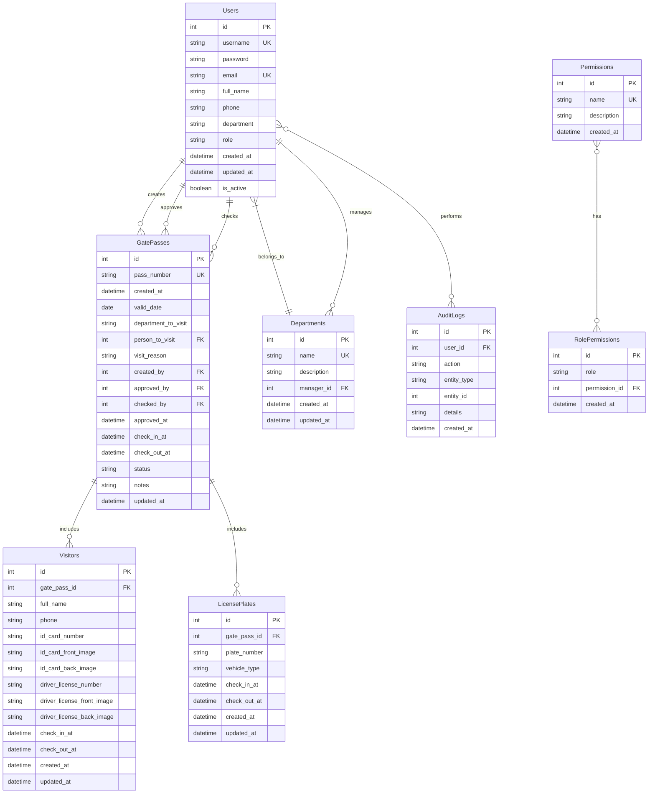

# ER Diagram cho Hệ thống Quản lý Ra Vào Cổng

Dưới đây là mô tả ER diagram cho hệ thống dưới dạng Mermaid syntax:

## Chú thích

- **PK**: Primary Key (Khóa chính)
- **FK**: Foreign Key (Khóa ngoại)
- **UK**: Unique Key (Khóa duy nhất)

## Các mối quan hệ chính

1. **Users - GatePasses**:
   - Một người dùng có thể tạo nhiều phiếu (1:n)
   - Một người dùng có thể duyệt nhiều phiếu (1:n)
   - Một người dùng có thể kiểm tra nhiều phiếu (1:n)

2. **Users - Departments**:
   - Một người dùng thuộc về một phòng ban (n:1)
   - Một phòng ban có thể có một người quản lý (1:1)

3. **GatePasses - Visitors**:
   - Một phiếu có thể có nhiều khách (1:n)

4. **GatePasses - LicensePlates**:
   - Một phiếu có thể có nhiều biển số xe (1:n)

5. **Permissions - RolePermissions**:
   - Một quyền có thể thuộc về nhiều vai trò (1:n)

6. **Users - AuditLogs**:
   - Một người dùng có thể có nhiều hoạt động được ghi nhật ký (1:n) 